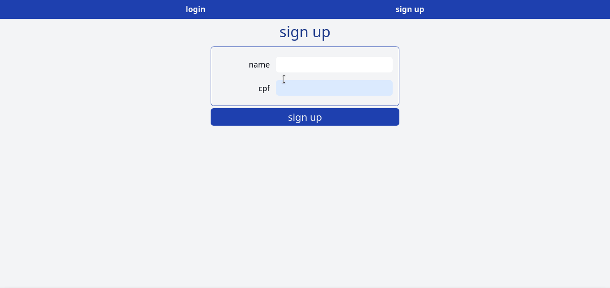

# Simple Bank Front

#### Front End for consuming Simple Bank API



The API be available [in this repository](https://github.com/vitor-msp/simple-bank-api)

## Execution

1. Clone this repository
```
git clone https://github.com/vitor-msp/simple-bank-front.git
```

2. Access the downloaded folder
```
cd simple-bank-front
```

3. Create file with environment variables
```
cp .env.sample .env
```

4. Install Node dependencies
```
npm install
```

5. Run site
```
npm start
```

6. Access [site URL](http://localhost:3000)

## Notes

1. The port 3000 in your machine must be free